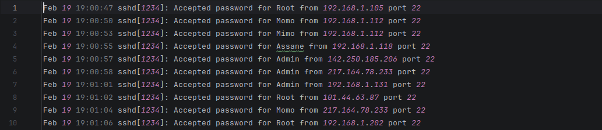
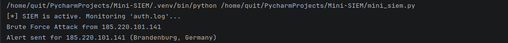
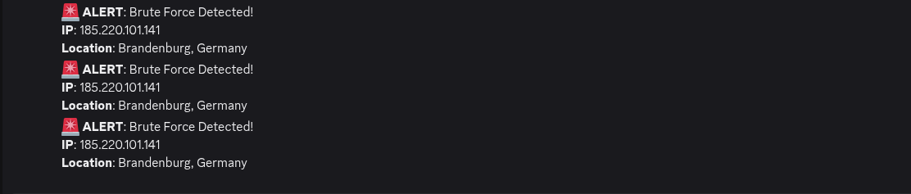

# Mini-SIEM (Log Analysis & Alerting Tool)


A Python-based "Mini-SIEM" (Security Information and Event Management) tool that simulates real-world SOC operations. This project demonstrates the ability to monitor log files in real-time, detect threat patterns (like Brute Force attacks), and trigger automated alerts via Webhooks.

---

## 🎯 The Goal

In a real Security Operations Center (SOC), analysts cannot read every single log line manually. We build tools to do the watching for us.

This tool:
1.  **Simulates a Server** (`log_generator.py`): Creates fake login traffic (both good and bad).
2.  **Acts as the SIEM** (`mini_siem.py`): Watches the logs, remembers failed login attempts, and alerts you if an IP address fails too many times in a short window.

---

## ✨ Key Features

*   **Real-Time Monitoring:** Uses the `watchdog` library to detect file changes instantly.
*   **Threat Detection Logic:** Identifies Brute Force attacks (e.g., 3 failed logins within 60 seconds).
*   **Regex Parsing:** Extracts IP addresses, timestamps, and users from raw text using Regular Expressions.
*   **IP Whitelisting:** Allows you to mark specific IP addresses as "Safe" so they never trigger alerts.
*   **Geo-Location Enrichment:** When an attack is detected, it looks up the attacker's Country and City.
*   **Automated Alerting:** Sends a formatted alert message directly to a Discord or Slack channel.

---

## 🛠️ Technologies Used

*   **Python:** Core scripting language.
*   **Regex (`re`):** For pattern matching and log parsing.
*   **Watchdog:** For monitoring file system events.
*   **Requests:** For making API calls (Geo-location and Webhooks).

---

## 🚀 How to Install & Run

### 1. Prerequisites
You need Python installed on your machine.

### 2. Setup
1.  Clone or download this project folder.
2.  Open your terminal/command prompt in the folder.
3.  Install the required libraries:
    ```bash
    pip install -r requirements.txt
    ```

### 3. Configuration
*   Open `mini_siem.py`.
*   Scroll to the bottom `if __name__ == "__main__":` block.
*   Replace `"PASTE_YOUR_WEBHOOK_URL_HERE"` with your actual Discord or Slack Webhook URL.

### 4. Running the Tool
You need **two separate terminal windows** to run this simulation.

**Terminal 1 (The Attacker):**
This script simulates traffic and creates the log file.
```bash
python log_generator.py
```

**Terminal 2 (The Defender):**
This script is your SIEM. It watches the file and sends alerts.
```bash
python mini_siem.py
```

---

## 📸 What it looks like

*(Add screenshots here! Recruiters love visuals.)*
1.  A screenshot of the `auth.log` file growing.
    
2.  A screenshot of the Console printing "SIEM is active...".
    
3.  A screenshot of the Discord/Slack alert message.
    

---

## 🧠 How it Works (Logic)

1.  **The Parser:** Reads a raw line like `Oct 25 10:00:01 sshd[1234]: Failed password for root from 1.2.3.4` and breaks it into a dictionary: `{IP: "1.2.3.4", Status: "Failed"}`.
2.  **The Brain (Detection Engine):**
    *   If the status is "Accepted", it forgets the IP (trust established).
    *   If the status is "Failed", it checks its memory.
    *   If that IP has failed recently (within 60 seconds), it adds a tick mark.
    *   If the tick marks reach the **Threshold** (default is 3), it triggers an alert.
3.  **The Notifier:**
    *   Takes the attacker's IP.
    *   Calls a Geo-API to find "Country: X, City: Y".
    *   Sends a `POST` request to your Webhook URL.

---

---

## 👨‍💻 Author

**Mouhamed Moustapha Sabaly** - *Aspiring SOC Analyst / Python Developer*

*This project was built to demonstrate proficiency in automation, threat logic, and Python scripting for cybersecurity roles.*
